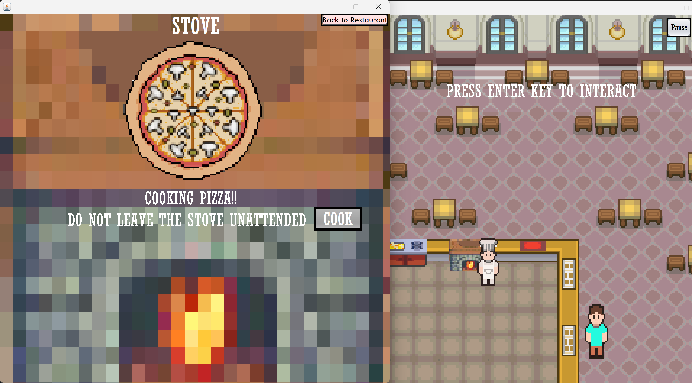

# 🍕 GK's Pizza

## 🎮 About

A pizza shop simulation game built with **Java Swing**. Step into the shoes of a pizza chef — take orders from customers, prepare pizzas using a variety of appliances, and deliver them before time runs out! Use the on-screen visual aids and buttons to guide you through the pizza-making process. Project was created in 2024.



## 🎮 Features

* **Pizza Shop Simulation**: Run your own pizza restaurant from start to finish
* **Order System**: Receive and fulfill customer orders
* **Multiple Appliances**: Use different stations to prepare your pizzas
* **Interactive UI**: On-screen buttons and visual aids guide you through each step
* **Multiple Screens**: Navigate between the main menu, instructions, gameplay, and appliance interaction panels
* **Pause Menu**: Take a break whenever you need to

## 🕹️ Controls

| Key | Action |
| --- | --- |
| **W/A/S/D** | Move the player around the shop |
| **Enter** | Interact with stations |

## 🏪 Appliances

* **Saucing Station** — Apply sauce to your pizza
* **Topping Station** — Add toppings to your pizza
* **Stove** — Cook your pizza
* **Front Counter** — Deliver completed orders to customers

## 🖥️ Screens

* **Main Screen** — Start or quit the game
* **Instructions Panel** — Learn how to play
* **Game Screen** — The main gameplay area where you move around and interact with appliances
* **Appliance Panels** — A dedicated interaction screen pops up when you use each appliance

## 🚀 How to Run

```
# Clone the repository
git clone https://github.com/garishan06/GKsPizza.git

# Navigate to project directory
cd GKsPizza

# Compile all Java files
javac src/gkspizza/*.java src/gkspizza/characters/*.java src/gkspizza/appliances/*.java

# Run the game
java -cp src gkspizza.GameFrame
